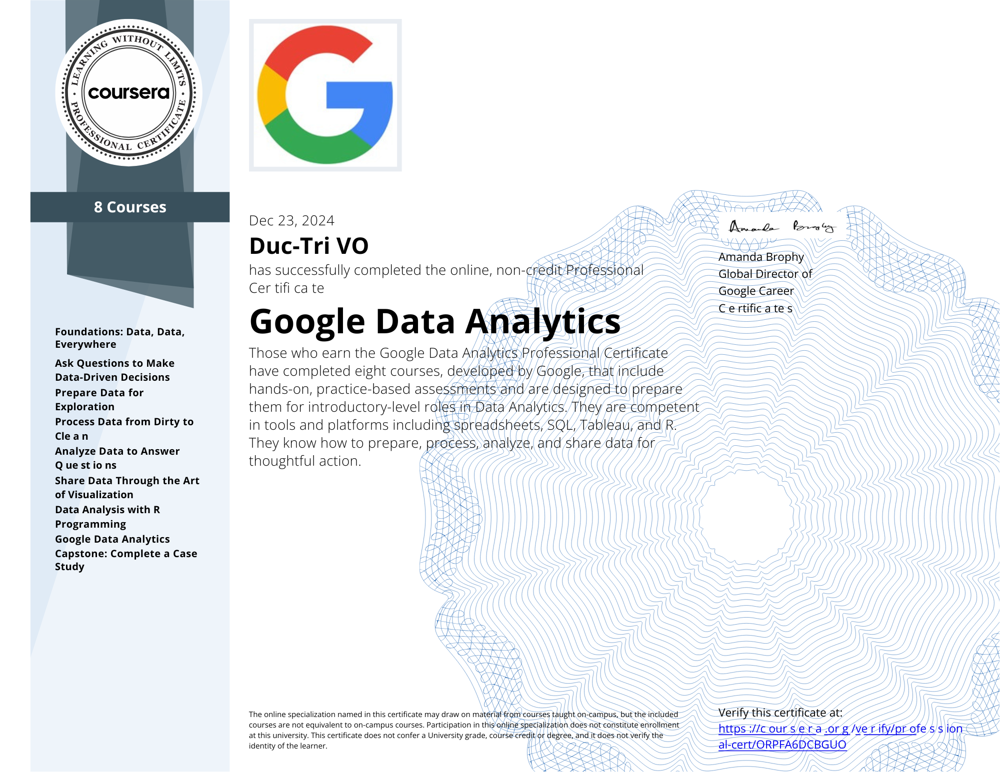

# Google Data Analytics Professional Certificate

Verify link: [Coursera.com](https://coursera.org/share/1ba31ed461e78d363c37116d46108a82)

Those who earn the Google Data Analytics Professional Certificate have completed eight courses, developed by Google, that include hands-on, practice-based assessments and are designed to prepare them for introductory-level roles in Data Analytics. They are competent in tools and platforms including spreadsheets, SQL, Tableau, and R. They know how to prepare, process, analyze, and share data for thoughtful action.

### Courses:
1. Foundations: Data, Data, Everywhere
2. Ask Questions to Make Data-Driven Decisions
3. Prepare Data for Exploration
4. Process Data from Dirty to Clean
5. Analyze Data to Answer Questions
6. Share Data Through the Art of Visualization
7. Data Analysis with R Programming
8. Google Data Analytics Capstone: Complete a Case Study